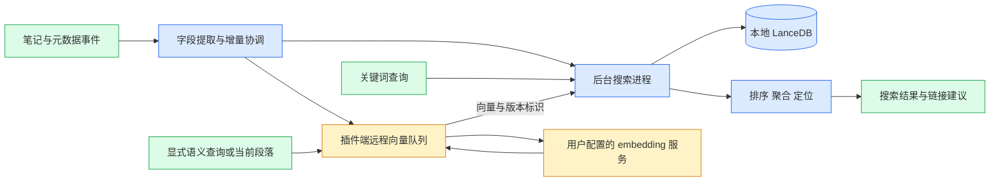

# 桌面嵌入式笔记搜索实施计划

状态：当前以个人自用为交付目标，M0–M3 已实现，可使用本地关键词搜索，并手动配置远程语义与混合搜索。语义检索已改为 IVF_FLAT ANN，并支持复用现有向量的本地迁移。继续采用用户全局安装 `@lancedb/lancedb@latest`，不固定 SDK 或 Arrow 版本。100 条人工标注查询、OmniSearch 基线和第二台 Obsidian Sync 设备均不作为交付前置条件；M4 未开始。实测边界见 [M0](M0-VALIDATION.md)、[M1](M1-VALIDATION.md)、[M2](M2-VALIDATION.md)、[M3](M3-VALIDATION.md)和 [ANN 验证报告](ANN-VALIDATION.md)。

采用桌面嵌入式 LanceDB，在 macOS Apple Silicon 上提供中英混合笔记搜索。先交付本地关键词搜索，再通过用户手动配置的远程 embedding 服务加入语义搜索和相关笔记推荐。无需保留 OmniSearch 的 API、查询语法、缓存、设置或实现兼容性。

## 产品范围

| 项目 | 已确认决策 |
| --- | --- |
| 交付目标 | 先在自己的 vault 使用，按实际使用反馈迭代；当前不安排公开发布评审 |
| 首版平台 | macOS Apple Silicon；其他平台分别验证后再扩展 |
| 安装方式 | 用户安装 Node.js/npm，执行 `npm install -g @lancedb/lancedb@latest`，再手动安装插件包；无需单独管理数据库服务 |
| 首版内容 | Markdown 的标题、别名、标签和正文；PDF、图片文字及 Canvas 暂不索引 |
| 关键词搜索 | 原生 ICU 基线，多词在同篇笔记中全部满足，标题和别名优先，支持短语、路径和标签过滤 |
| 数据库运行 | 插件管理的后台搜索子进程；每个 vault 在本设备只有一个写入者 |
| 索引归属 | vault 内设备独立的可重建缓存；不同步数据库，Markdown 是内容事实来源 |
| 语义能力 | 远程 OpenAI-compatible embeddings，手动填写地址、模型和密钥；未配置时正常使用关键词搜索 |
| 文本发送 | 用户明确选择目录或全部 Markdown，可额外排除；发送正文片段及正文内标题上下文 |
| 调用时机 | 首次手动建立语义索引，之后自动增量；选择语义搜索模式或执行相关笔记命令时才发送查询 |
| 相关笔记 | 以当前段落为上下文展示相关笔记与命中片段，选择后插入 wikilink |

首版不以官方社区目录一键安装为要求，不自动下载或更新原生可执行资源。自动链接、输入 `[[` 时的补全、本地模型推理和厂商专有 embedding 接口不属于本计划范围。

## 架构与职责



| 模块 | 职责 |
| --- | --- |
| `src/main.ts` | 生命周期、命令、设置注册及清理 |
| `src/runtime/` | 子进程启动、IPC、请求编号、占用检测、退出与恢复 |
| `src/search-host.ts`、`src/backend/` | 独立后台入口，持有 LanceDB 连接，执行查询、写入和索引维护 |
| `src/indexing/` | Markdown 字段、内容版本、原文位置、事件合并和增量队列 |
| `src/search/` | 查询规划、字段召回、排序、按笔记聚合与高亮定位 |
| `src/embeddings/` | 远程配置、请求契约、队列、向量校验和模型配置版本 |
| `src/ui/`、`src/settings.ts` | 搜索交互、索引状态、模型配置及范围选择 |

UI 和设置不持有数据库连接。公共搜索结果包含笔记、分数和定位信息，避免直接向 UI 暴露数据库返回结构。密钥由插件端读取，数据库子进程只接收生成的向量和版本标识。子进程不开放网络监听端口。

## 运行与平台交付

第一阶段验证实际 Obsidian 使用用户安装的 Node.js 启动搜索子进程，并从 npm 全局目录加载 LanceDB。记录真实宿主与子进程 `process.versions`、SDK 版本、架构和加载路径；不以某个安装版本号代替原生行为验证。

按 [ADR 0003](adr/0003-global-latest-lancedb.md) 使用全局安装的 latest。Node 从 PATH 或设置指定路径解析，全局模块目录由 `npm root -g` 或设置提供。插件不使用宿主 Node 模式、不修改 fuse、不自动安装或更新依赖，也不使用 Node Worker 替代原生崩溃隔离。`latest` 表示用户执行安装/更新命令时的最新发布；运行时使用其已安装版本，检查必需 API 与原生行为，不设精确版本白名单。

继续使用 npm 与 esbuild，构建插件和后台两个入口。平台包布局为：

```text
<plugin-id>/
  main.js
  search-host.cjs
  manifest.json
  styles.css                 # 如有
  resources.json             # 插件版本、依赖模式和插件文件完整性摘要
  LICENSE
```

插件代码分别打入两个入口。LanceDB JS、Arrow 和原生库均来自用户的全局 npm 安装，不包含在插件包内；后台显式加载所选全局目录，不隐式回退到开发目录。资源清单只校验插件文件，不固定用户的全局 SDK。全局版本升级后重新检查环境；实际 npm 安装及宿主加载必须验证 macOS 兼容性。构建产物不提交 Git。

manifest 声明桌面专用，AGENTS.md 允许双入口、外部 Node.js 和显式全局依赖加载。采用 SecretStorage 的语义版本要求 `minAppVersion >= 1.11.4`；M2 已把声明收敛为实际验证过的 Obsidian `1.13.7`，并更新版本映射。plugin ID 保持 `lancedb-search`。

重活放在后台，启动时先恢复必要状态再异步核对文件；避免 onload 全库扫描。重复打开同一 vault 时检测占用并给出可恢复状态，首版不实现跨窗口进程共享。插件停用时停止新任务、关闭数据库、退出进程并注销监听；异常退出允许有界恢复，禁止无限重启。

## 数据模型与索引一致性

| 逻辑实体 | 主要信息 | 用途 |
| --- | --- | --- |
| 笔记 | 本地 noteId、路径、标题、别名、标签、内容版本 | 笔记级关键词检索与过滤 |
| 文本片段 | chunkId、noteId、正文内标题层级、原文位置、内容哈希 | 定位、向量生成、相关段落证据 |
| 向量 | chunkId、向量空间标识、维度、内容版本、向量 | 语义检索与混合排序 |

这是领域与存储的边界，物理表布局在首个检索原型中验证。noteId 由本地索引维护，不写入笔记 frontmatter；在线改名维持本地关联，离线改名可按旧路径删除和新路径新增恢复。

事件合并后由单一写入队列提交，每个任务带内容版本与配置代次。修改、删除、改名、退出或范围变更后，旧任务即使迟到也不能恢复过期内容；搜索返回前校验当前有效版本。不能假设多个表之间具有应用需要的事务原子性。

关键词索引与向量索引独立更新。重建使用新索引代次，完成后切换；未完成的代次不冒充可用索引。后台维护按未索引数据和实际时延调度，不在每次保存时执行全量优化。

语义检索使用 cosine IVF_FLAT ANN。分区数为向量行数平方根向下取整，范围 1–256；默认探测 128 个分区。过滤后不足 200 个片段时显式扩大到最多 256 个分区。每次提交最多获取 4 批候选，每批最多返回 200 个片段，排除已返回笔记并复核版本，最终返回最多 50 篇笔记。近似结果和数量不代表完整匹配集；小库或很窄的过滤可以扫描全部分区。

新向量代次先建 ANN 再发布；旧向量缓存在首次语义查询时本地补建，不改变模型空间、不重新发送笔记。每累计 128 次笔记写入/删除或 1,024 个写入片段执行维护；重启读取原生未索引行数。查询包含尚未并入索引的新增数据。分区需求达到原分区数两倍时，在维护中使用已有向量重新训练；索引参数保存在向量字段元数据中。

缓存位于 vault 内的插件专属目录，与发布资源和用户设置分开。安装文档给出 Git、Obsidian Sync 和其他同步工具的排除方法，注明已验证范围；实际使用同步工具时配置缓存排除，不能声称目录名本身可以阻止同步。设备之间分别建库，不合并数据库文件。单机自用无需准备第二台设备进行 Sync 验收。

升级时先退出 Obsidian，再替换完整平台包并保留设置；数据库格式不兼容时提示重建。回退也可以重建缓存，不承诺跨版本数据库格式兼容。重建不得修改 Markdown；远程向量重建需用户发起，不能因关键词缓存失效静默触发全量远程调用。

## 关键词搜索语义

原生 ICU 为中英混合基线，显式设置小写归一化、关闭 stemming 和停用词移除、保留词位。应用层负责 Markdown 字段提取、查询语义及技术标识符扩展。选定 SDK 必须实际支持这些配置；若中文质量不达标，再比较同版本可用的原生 Jieba。

多词默认要求同篇笔记全部满足，允许词分布在不同段落或字段。标签与路径作为过滤条件，标题和别名精确匹配优先；短语按源字段验证，不允许因字段拼接产生不存在的连续短语。过滤应参与候选选择，不能先截取少量候选再过滤而静默漏掉相关结果。

正文保留自然词序，驼峰和连字符扩展进入独立辅助召回字段，不将合成 token 混入正文改变词频和位置。高亮映射到当前版本的 Markdown 原文位置；无法验证版本或位置时重新取内容，不能跳到旧偏移。

首版按笔记展示并定位最佳命中段落。后续分块向量按 noteId 聚合，限制长文凭分块数量占满结果。混合搜索使用基于排名的融合，不直接相加 BM25 分数与向量距离；具体字段权重和候选规模由评测确定。

## 远程 embedding 配置与契约

首个接口支持 OpenAI-compatible JSON embeddings 子集，不绑定厂商或模型。

| 配置 | 行为 |
| --- | --- |
| API base URL | 用户输入包含版本路径的地址；追加 `/embeddings`，不自动猜测或重复追加 `/v1` |
| 模型 ID | 用户手动输入，运行前通过连接测试校验 |
| API Key | 使用 Obsidian SecretStorage；普通设置仅保存 secret 名称 |
| dimensions | 可选，默认不发送；只有提供方支持且用户明确配置时才发送 |
| 等待时限与并发上限 | 可配置；等待超时不等于底层 HTTP 请求已取消 |
| 语义范围 | 用户显式选择目录或全部 Markdown，支持额外排除项 |
| 队列控制 | 建立语义索引、暂停、恢复，以及配置变化后的重建 |

请求使用 Bearer 认证、文本数组和 `encoding_format: float`。依据 `data[].index` 对齐返回向量，校验 index 完整性与唯一性、数值有效性、数量和统一维度；实际维度从测试响应确认。模型输入长度、批大小与限流是提供方约束，不能将某一厂商的限制套用到所有端点。

连接测试只发送内置公开中英测试句，须由用户主动执行；保存配置不发送请求。测试成功不会自动启用语义索引。普通设置、日志和错误消息不保存密钥、认证头或笔记正文。SecretStorage 是宿主集中存储，不是插件间的密钥权限隔离边界。

语义范围默认未启用。本地关键词排除项也约束语义范围，允许进一步排除；仅发送正文片段与正文内标题上下文，不额外附加文件名、路径、标签字段或 frontmatter。正文中原本包含的信息不因此被自动脱敏，界面应准确说明发送内容。

首次选择“建立语义索引”后发送选定范围，之后只为变更片段自动增量生成。普通关键词输入、光标移动不发起远程请求；用户选择语义搜索模式后提交查询，或执行相关笔记命令时才调用。范围缩小时停止待发送任务并移除相应向量的有效性；扩大范围先展示新增范围，再由用户明确启动新增建库。

远程队列独立于关键词更新。网络故障有界退避；认证、契约或维度错误暂停并提示修正配置。停止或超时后不接纳迟到结果；requestUrl 无公开取消参数，因此不能承诺中断已发出的请求，也不能在旧请求仍在途时因超时无限叠加重试。远程失败时保持关键词搜索可用并标明语义状态。

向量空间标识包含 endpoint、模型 ID、实际维度和输入预处理版本；同维度不代表同空间。密钥轮换本身不触发重算；endpoint、模型或输入规则变化进入新空间，暂停旧配置任务，经测试连接并由用户发起重建后再发送笔记。对于提供方在同一模型 ID 下更新模型的情形，保留手动强制重建入口，不声称可以自动检测。

发送前和响应入库前都校验内容版本、启用状态、范围和向量空间。向量持久化在本地，用户暂停任务后不再提交新请求；重建展示待处理规模，不在未知费率下编造金额。

## 相关笔记推荐

读取当前段落，显式发起语义查询，按笔记聚合并展示相关片段。当前笔记不在已启用语义范围内时，不发送段落并提示范围限制。排除自身，对已有链接明确标记或排除，避免重复插入。用户选择结果后，复核活动笔记、内容版本和插入位置，再通过 Obsidian 链接接口生成合法 wikilink。取消操作不写入笔记；推荐相似不等于已经存在链接。

## 实施阶段与自用交付

### 已完成：M1 本地关键词搜索

- 首次打开搜索时启动后台、恢复本设备缓存并异步核对 Markdown；不在 `onload` 读取全库正文。
- 提取文件标题、frontmatter 别名、标签和保留原文偏移的正文；本地 noteId 不写入笔记，技术标识符扩展使用独立字段。
- 实现多词 AND、双引号短语、`path:` 路径包含过滤和 `tag:` 标签过滤；先过滤候选，再按标题/别名精确匹配与全文相关性排序。
- 串行批处理新增、修改、删除、改名事件，保存去抖；处理期间的新事件使旧结果失效。设置支持本地目录排除。
- 提供搜索命令、索引状态、结果片段和经过内容版本复核的原文定位，以及手动重建入口。
- 使用全局 SDK 做发布包集成验证，并在实际 Obsidian 记录中英文、跨字段、跨段落、冷启动、保存更新和停用行为。规模及真实相关性评测单独记录，未验证不标记达标。

已交付 M1 可运行原型：实际 Obsidian 小库保存到可检索为 272–280 ms；259 篇合成笔记的原生安装包查询含 IPC p95 为 2 ms。1 万篇、约 102 MiB 的后端建库约 11 秒；全库命中的单次宽泛查询约 206 ms，后续优化结果见 M2。以上不是人工相关性评估或所有硬件的保证。

### 已完成：M2 稳定性与自用交付

1. 查询先排序轻量候选，校验当前版本后仅为前 50 篇读取片段；万篇宽泛词查询连同片段读取的后端 p95 约 32 ms。短语仍需源字段验证，不把这一数字推广为所有查询的保证。
2. 设备 ID 保存到 Obsidian 本机 vault 存储，不随插件设置同步；使用 macOS 内核文件锁，正常退出或 SIGKILL 都自动释放，不删除锁文件抢占。进程异常最多自动重启两次，重新核对 Markdown；停用取消重启。
3. 新索引在独立代次建立，完成后原子替换并持久化当前指针；重建期间旧索引可用，事件同步更新新旧代次。写入携带代次编号，旧任务不能污染新代次；中断重建在重启后清理，格式/字段不兼容时提示手动重建。
4. 维持 32 篇批处理；在队列空闲时按变更数量、正文体积与维护间隔判断原生整理，重新打开数据库时读取未索引行数。之前的代次在下次成功启动或下次重建前清理。
5. 已验证独立安装包、真实 Obsidian 恢复/停用/定位，以及 Git 和显式 rsync 排除；最低宿主声明为已验证的 1.13.7。构建工作流已加入 M2 集成检查，但未运行远程 CI 或发布。

### 当前使用与后续迭代

- 按 README 手动安装现有插件包，在自己的 vault 中使用关键词搜索。
- 遇到漏召回、排序或延迟问题时记录具体笔记与查询，按实际问题补充回归与优化；不要求固定数量的人工标注或竞品基线。
- 若后续使用跨设备同步，再针对实际配置检查缓存排除；本机 rsync 结果不代表 Obsidian Sync 已验证。
- 保留 M2 报告中的测量口径与已知限制，包括维护期间查询等待；这些记录用于后续优化。

### 已完成：M3 远程语义与混合搜索

- 提供 API 地址、模型、SecretStorage 密钥引用、可选维度、片段长度、批大小、并发及超时设置。手动连接测试只发送两条内置公开句子；保存配置暂停远程工作，不发送请求。
- 默认关闭。手动预览并建立语义索引后，按已授权范围自动增量；本地排除项始终生效。范围缩小立即失效，扩大范围需再次建库，恢复操作不会扩大授权范围。
- 按正文段落分块并携带正文标题上下文；前后校验笔记版本。未变化片段复用向量，frontmatter 或文件名变化不要求重算正文向量。
- 后台使用独立向量代次和原子切换，模型空间包含端点、模型、实际维度与预处理配置；缓存缺失或不兼容不自动发起全量远程重建。
- 语义与混合查询通过 Enter 或按钮明确提交，输入、切换模式和索引更新不调用模型。路径/标签过滤在本地执行，按笔记聚合片段，混合排序采用 RRF。
- 语义后端采用 IVF_FLAT ANN、有界候选和笔记去重补充；范围和已知过期笔记先过滤，返回前再次核验。ANN 建立、重启、增量维护和增长后的重训练全部复用本地向量。
- 网络及限流最多重试两次，认证/契约/维度失败暂停远程调用。已超时的底层请求继续占用并发名额至实际结束，迟到结果不入库；关键词搜索保持可用。
- 已验证实际全局 SDK、受控响应契约，以及真实 Obsidian 的 SecretStorage、HTTP、建库和搜索定位。商用提供方与真实语义质量尚未测量，属于当前测试范围说明。
- ANN 原生执行计划、小数据集、旧缓存迁移、长笔记、过滤、增删改及失败隔离已验证；新增 1 万篇笔记、3 万个 384 维向量的合成基准和精确召回对照，详见 [ANN 验证报告](ANN-VALIDATION.md)。

下一项产品开发是 M4 的当前段落相关笔记推荐与 wikilink 插入，按自用需求推进。远程调用继续保持手动启用和范围约束。

| 阶段 | 交付内容 | 通过条件 |
| --- | --- | --- |
| M0 原生交付验证 | 全局 latest 安装、双入口构建、环境设置与能力探测、插件包 | 实际 Obsidian 使用外部 Node 和全局 SDK、建立 ICU FTS、关闭后重开；不依赖开发仓库；搜索进程异常不影响编辑；停用后无进程残留 |
| M1 关键词搜索 | Markdown 提取、笔记级索引、查询规划、增量队列、弹窗与定位 | 中英混合及跨段落/跨字段查询通过；标题和别名排序正确；保存更新与冷启动有实测记录 |
| M2 稳定性与自用交付 | 单写入者、版本校验、崩溃恢复、维护、升级与回退说明 | 删除后旧任务无法恢复旧结果；重建保留笔记和设置；进程恢复、缓存兼容性与本机安装流程通过 |
| M3 远程语义 | 手动配置、连接测试、范围启用、向量队列、语义及混合搜索 | 未启用时无笔记外发；契约、范围和模型隔离正确；网络失败不影响关键词搜索 |
| M4 相关笔记 | 当前段落推荐、证据片段、选择后插入链接 | 自身与重复链接处理正确；异步结果不插到错误笔记；生成链接可跳转 |

首个关键词版本完成 M0–M2；语义与相关笔记版本完成 M3–M4。M0 失败时先解决运行时或交付问题，不扩大功能范围。日期与资源预算根据阶段实测安排，不能以构建成功代替宿主验证。

## 自用验收与性能记录

| 维度 | 目标与方法 |
| --- | --- |
| 规模 | 构造 1 万篇 Markdown、约 100 MiB 正文，另测超长笔记及批量导入；这是测试目标，不代表已测得的用户 vault |
| 查询延迟 | 预热后关键词后端 p95 ≤100 ms；独立记录去抖、IPC、UI 展示、并发建库时延迟、内存峰值和磁盘占用 |
| 新鲜度 | 常规小笔记保存后 ≤2 秒可检索；大文件和导入另测，不套用该时限 |
| 质量 | 保留中英混合、短语、过滤和标题/别名排序的回归检查；日常使用中按实际问题补充用例，不要求固定查询数量或 OmniSearch 基线 |
| 一致性 | 新增、连续修改、改名、删除、崩溃与重启；过期任务不能使旧内容有效，已删除结果不得残留 |
| 自用安装包 | 用户按说明安装 Node/npm 和全局 latest 后，在无开发仓库条件下运行；覆盖自定义全局目录、Finder PATH、正常启停、异常退出、升级、路径含中文和空格 |
| 远程边界 | 保存配置不联网；连接测试只发测试句；发送严格受范围约束；普通关键词输入不调用模型 |
| 远程错误 | 模拟乱序响应、缺失/重复 index、错误维度、超时、限流、鉴权失败、模型切换与任务停用；迟到结果不污染索引 |
| 推荐交互 | 请求途中切换笔记、编辑段落、改名或删除目标；取消无写入，确认后链接位置正确 |

表中的性能数值用于跟踪优化，实测结果与适用范围以 M2 报告为准；不因缺少额外真实语料评测而阻塞当前自用。功能正确性、索引一致性和进程生命周期检查保留。合成规模测试不代表人工相关性评测；远程响应时间和调用量单独报告，不套用本地 100 ms 目标。

检查按改动运行：每个代码阶段执行相应类型检查、构建和 lint；查询语义、并发版本和远程契约使用针对性测试；原生加载与发布包必须在实际 Obsidian 验证。修改文档本身无需运行插件构建或行为测试。

## 技术验证项与决策依据

当前产品决策已收敛为外部 Node.js 与全局 latest。最低兼容宿主、不同 Node 安装方式和未来 SDK 的原生兼容性仍需实测；失败时报告具体环境问题，不默默切换运行架构或依赖版本。

- [ADR 0001](adr/0001-desktop-embedded-lancedb.md)：桌面嵌入式、后台进程和手动平台包。
- [ADR 0002](adr/0002-manually-configured-remote-embeddings.md)：手动配置远程 embedding 及发送边界。
- [ADR 0003](adr/0003-global-latest-lancedb.md)：用户全局安装 latest，不分发或固定 SDK、Arrow 和 Node。
- [术语表](../CONTEXT.md)：关键词搜索、语义搜索、相关笔记推荐与语义索引范围。
- [Obsidian 发布说明](https://docs.obsidian.md/plugins/releasing/submit-plugin)与[开发者政策](https://docs.obsidian.md/community-directory/developer-policies)：标准安装资源及依赖更新边界。
- [LanceDB latest 元数据](https://registry.npmjs.org/@lancedb/lancedb/latest)：Node 与平台依赖要求以用户当前安装版本为准；不固定版本。
- [LanceDB FTS 配置](https://lancedb.github.io/lancedb/js/interfaces/FtsOptions/)及[分词器类型](https://lancedb.github.io/lancedb/js/type-aliases/BaseTokenizer/)：当前 API 文档，不能替代选定二进制验证。
- 本次读取的本机安装包元数据为 Obsidian 1.13.7、Electron 43.3.0；[Electron 发布清单](https://releases.electronjs.org/releases.json)对应 Node 24.18.1。安装包元数据不等于应用内实时版本或加载结果。
- [Electron runAsNode fuse](https://www.electronjs.org/docs/latest/tutorial/fuses#runasnode)、[utilityProcess](https://www.electronjs.org/docs/latest/api/utility-process)与[Node Worker](https://nodejs.org/api/worker_threads.html#class-worker)：进程启动条件、main process 限制及线程隔离边界。
- [OpenAI embeddings API](https://developers.openai.com/api/reference/resources/embeddings/methods/create)：最小兼容契约参照，其他服务须实际验证。
- [Obsidian SecretStorage](https://docs.obsidian.md/plugins/guides/secret-storage)与[公开类型声明](https://github.com/obsidianmd/obsidian-api/blob/master/obsidian.d.ts)：密钥引用与 requestUrl；当前无公开请求取消、timeout 或 redirect 控制字段。
